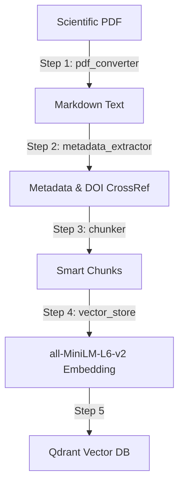

# Slide Presentasi: Inovasi Retrieval & Migrasi Embedding PEDE

---

## Slide 1: Pendahuluan & Latar Belakang

### Apa itu PEDE?
* **PEDE (PDF to Model Embedding)**: Pipeline untuk mengonversi dokumen ilmiah PDF menjadi vector embeddings yang terstruktur di Qdrant Vector Database.
* **Tujuan Projek**: Mengekstrak teks & metadata cerdas dari PDF, memecahnya menjadi potongan informasi (*chunking*), lalu menyimpannya dalam bentuk vektor agar siap digunakan oleh model bahasa besar (LLM/Gemini) dalam arsitektur **RAG (Retrieval-Augmented Generation)**.

---

## Slide 2: Alasan Migrasi Embedding Model

### Dari `BGE-M3` ke `all-MiniLM-L6-v2`
Mengapa kita melakukan pengujian migrasi ini?
1. **Kecepatan Komputasi (Latensi)**: Vektor berdimensi tinggi (1024-d) di BGE-M3 membutuhkan waktu komputasi yang lebih lama daripada model ringan (384-d).
2. **Efisiensi Memori (Resource Cost)**: Mengurangi konsumsi RAM, VRAM, dan penyimpanan disk hingga **~63%** per vektor.
3. **Studi Kasus Dominan**: Jika basis data jurnal sebagian besar menggunakan Bahasa Inggris, MiniLM sangat efisien dan mumpuni tanpa perlu *resource* besar.

---

## Slide 3: Perbandingan Spesifikasi Model

| Parameter | BAAI/bge-m3 (Lama) | all-MiniLM-L6-v2 (Baru) |
| :--- | :---: | :---: |
| **Dimensi Vektor** | 1024 (Dense) + Sparse | 384 (Dense Only) |
| **Batas Input Teks** | 8,192 token | 256 token |
| **Jenis Pencarian** | Hybrid (Dense + Sparse / Lexical) | Dense-only (Cosine Similarity) |
| **Fokus Bahasa** | Multilingual (>100 Bahasa) | Mayoritas Bahasa Inggris |
| **Kebutuhan Memori** | Tinggi | Sangat Ringan |

---

## Slide 4: Alur Pipeline Data PEDE

---

## Slide 5: Perubahan Penting di Sisi Kode

1. **`core/vector_store.py`**:
   * Penggantian model embedding standar ke `all-MiniLM-L6-v2`.
   * **Proteksi Skema Otomatis**: Menambahkan pendeteksian otomatis ukuran dimensi vektor. Jika koleksi lama berdimensi 1024 ditemukan di Qdrant, sistem akan otomatis menghapus dan membuat ulang koleksi dengan dimensi 384 agar tidak terjadi error API.
2. **`ingest.py`**:
   * Deteksi folder cache Hugging Face dibuat dinamis mengikuti model yang sedang aktif.
3. **`scripts/dump_chunks.py`**:
   * Sinkronisasi nama koleksi dan path database yang langsung di-import dari modul konfigurasi utama.

---

## Slide 6: Metrik Hasil Pengujian (10 Kombinasi)

Pengujian 10 skenario kombinasi *Chunk Size* dan *Overlap* pada jurnal uji menghasilkan metrik sebagai berikut:

* **Hit Rate / Recall@5**: Stabil di **33.3%** di seluruh konfigurasi (untuk kata kunci uji terpilih).
* **Rata-rata Latensi**: Berada di rentang **17.1 ms - 23.7 ms** (sangat cepat).
* **Ukuran Index Database**: Meningkat sejalan dengan jumlah chunk yang dihasilkan (dari **1.50 MB** hingga **3.86 MB**).

---

## Slide 7: Rekomendasi Konfigurasi Paling Efisien

### **Pemenang: Chunk Size 800 | Overlap 80**
* **Kenapa dipilih?**
  * **Latensi Tercepat**: Hanya **17.1 ms**.
  * **Ukuran Database Ringkas**: **3.38 MB** (hanya terbagi menjadi 36 chunks).
  * **Sesuai Limitasi Model**: Panjang 800 karakter (~200 token) berada di bawah batas maksimal input MiniLM (256 token), sehingga menghindari pemotongan paksa (*truncation*) teks semantik.

---

## Slide 8: Kesimpulan & Rekomendasi Strategis

* **Gunakan `all-MiniLM-L6-v2` jika**:
  * Aplikasi berjalan di perangkat dengan spesifikasi terbatas (CPU / RAM rendah).
  * Kecepatan respon (latensi rendah) adalah prioritas utama.
  * Korpus dokumen dominan berbahasa Inggris.
* **Gunakan `BGE-M3` jika**:
  * Membutuhkan pencarian istilah eksak (kode, DOI, singkatan) menggunakan Hybrid Search (dense + sparse).
  * Dokumen memiliki bahasa beragam (terutama Bahasa Indonesia) untuk pencarian lintas bahasa.
